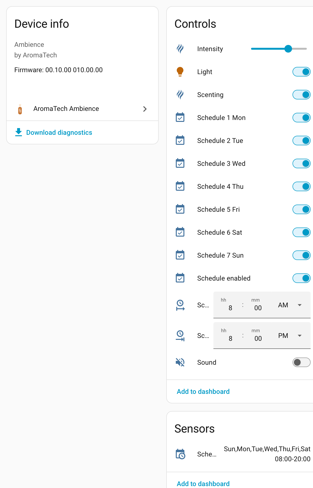
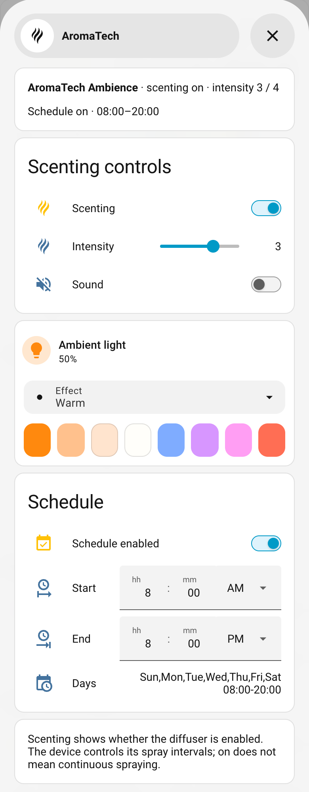

# Examples

Ideas for using the AromaTech Ambience integration, taken from a real setup.
Entity IDs assume the device is named **Ambience** (the default). If you
renamed it, adjust the IDs to match.

## What the integration gives you

The device page after setup: scenting, intensity, sound, the light, and the
full schedule, plus a diagnostics download for bug reports.

## A dashboard card

[`dashboard-card.yaml`](dashboard-card.yaml) builds the card below from core
Home Assistant cards only: a status line, scenting controls, the ambient light
with its effects and favourite colours, and the schedule. The screenshot shows
it inside a [Bubble Card](https://github.com/Clooos/Bubble-Card) pop-up. The
file explains how to wrap it the same way, but it works fine without.

## Automation ideas

[`automations.yaml`](automations.yaml) contains three ready-to-paste
automations:

1. **Day and night light level.** The lamp at 50% during the day and a 5%
   glow at night, keeping the selected effect.
2. **Pause scenting while away.** Turns scenting off after everyone has been
   out for 30 minutes, and restores exactly what it was on return.
3. **Unreachable alert.** A notification if the diffuser has been out of
   Bluetooth reach for an hour.

## Tips

- **Scenting on is not continuous spraying.** The device sprays in cycles set
  by the intensity level, and only inside its schedule window.
- **Intensity is part of the schedule.** Changing it rewrites the schedule on
  the device, and the integration confirms the new value before reporting
  success.
- **Keep the Bluetooth connection free.** Each poll connects briefly and then
  disconnects, so the diffuser does not permanently hold one of a proxy's few
  connection slots. Longer heartbeat intervals (Options) mean fewer
  connections.
